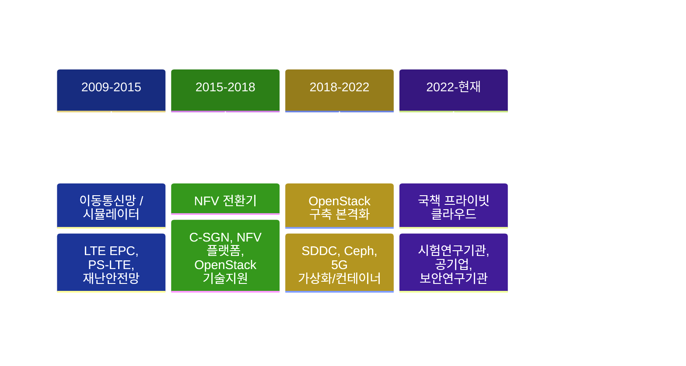

# Career

인프라 도메인 17년의 이력. 통신망 → NFV → OpenStack → 국책 프라이빗 클라우드로 이어지는 전문화 경로.

## 도메인 전환 궤적

## 클라우드 / 인프라 프로젝트

| 기간 | 프로젝트 | 역할 | 발주 유형 |
|---|---|---|---|
| 2025.11~ | N2SF Test-Bed 구축 | 클라우드 인프라 설계·구축 | 국가 보안 연구기관 |
| 2025.04~2025.11 | 프라이빗 클라우드 구축 | 클라우드 인프라 설계·구축 | 국가 시험인증 기관 |
| 2025.01~ | 데이터센터 유지보수 | 유지보수 | 공공 인프라 공기업 |
| 2024.12~2025.05 | 정보인프라 도입·증설 | 클라우드 인프라 설계·구축 | 공공 인프라 공기업 |
| 2024.04~2024.10 | 5G NSA 가상화 (RHOSP16) | 가상화 플랫폼 구축 | 국내 통신사 |
| 2022.09~2024.02 | 5G SA 컨테이너 플랫폼 | 컨테이너 플랫폼 구축 | 국내 통신사 |
| 2020.04~2022.07 | 5G NSA 가상화 (RHOSP13) | 가상화 구축·유지보수 | 국내 통신사 |
| 2019.11~2020.02 | 클라우드PC 업무환경 구축 | 클라우드 인프라 설계·구축 | 공공기관 |
| 2019.03~2019.06 | 통합정보시스템 SDDC 구축 | SDDC 구축 | 공공기관 |
| 2018.12~2019.03 | 지능형초연결망 선도사업 | NFV·OpenStack·Ceph 구축 | 지자체 |

??? note "이전 이력 (NFV / OpenStack 초기 · 2016~2019)"
    | 기간 | 프로젝트 | 역할 | 발주 유형 |
    |---|---|---|---|
    | 2019.09~2019.11 | CCS 시범망 구축 | 클라우드 인프라 구축 | SI 기업 |
    | 2019.07~2019.08 | SDDC 시스템 구축 | OpenStack 구축 | 지자체 |
    | 2019.01~2019.02 | 클라우드 시스템 구축 | OpenStack 구축 | 공공기관 |
    | 2018.10~2018.12 | OpenStack 기술지원 | Helion OpenStack | 국내 통신사 |
    | 2017.10~2017.12 | NFV 플랫폼 구축 | NFV 구축 | 지자체 |
    | 2016.09~2017.01 | C-SGN 시스템 구축 | NFV 플랫폼 구축 | 국내 통신사 |

??? note "통신망 엔지니어링 이력 (2009~2016)"
    | 기간 | 프로젝트 | 역할 |
    |---|---|---|
    | 2015.12~2016.06 | 재난안전망 시범사업 | 재난안전망 구축·검증 |
    | 2014~2015 | LTE-A, TD-LTE, PicoCell, Roaming GW 등 망 구축 | 이동통신망 구축 |
    | 2013 | IMS, MBMS 시스템 망 구축 | 이동통신망 구축 |
    | 2009~2012 | LTE EPC/UE 시뮬레이터 장비공급 | 기술지원 |
